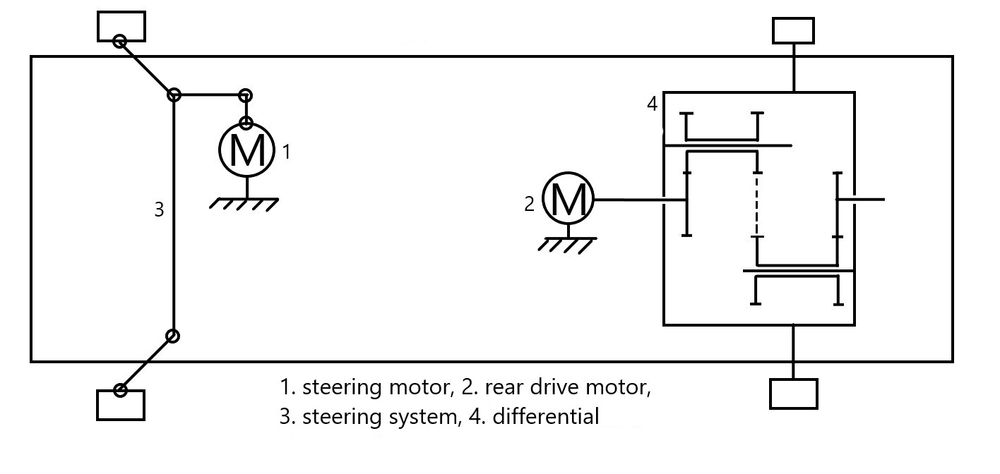

# White Storks, WRO FE Solution

## Videos

### [Qualification round](https://youtu.be/TMEs1yODBv8)
### [Final round](https://youtu.be/N_jFORARUJI)

# Hardware

Our robot is made from following components:
* Main computer - Raspberry Pi 4 4GB
* 1х RPi Camera (I), Fisheye Lens, 170deg FOV
* 1x SD card 16Gb
* 1х Battery Shield V8
* 2x 18650 LiIon Batteries
* 1х DRV1.5DC, 1.5A 2 way DC Motor Driver Module PWM
* 1х JGA25-370 DC GEAR MOTOR 25GA-370 with Speed Encoder
* 1х Servo MG90S for steering 
* 1x Lego differential gears
* 1x Coupling 4 to 5 mm
* 2x Wheels Lego 62,4
* 1x Amperka Troyka Button
* 1x KY-016 RGB Full color led module
* 1x 3D printed camera mount, stl file is `cam_mount_v2.0.stl`

## Photos

## Schematics

# Software

Components:

1. Main algorithm is done in `main.py`, [read more](#algorithm)
2. Configuration is done in files in `config` directory, [read more](#config)
3. Binarization and object detection, [read more](#object-detection)
4. There is smart algorithm for direction detection, [read more](#direction-detection).
5. Main movement algorithm is PID based on the distance from wall, [read more](#wall).
6. Markers detection is performed using hsv binarization and finding contours, [read more](#markers).
7. Lines are detected same way as markers, [read more](#turns-and-lines)
8. Turns is done using special "maneuver" algorithm, [read more](#turns-and-lines).
9. There is special program called `control.py` that helps with hsv binarization setup and hardware testing
10. Iterection with hardware done by code in `hardware` directory

## How to run 
1. Clone this repository
2. Install dependecies from `requirements.txt`
3. Run `sudo -E python3 ./main.py`

## Algorithm

Algorithm is implemented in `main.py`. There are two modes: Qualification and Final, configured in `config/config.py`.

Current sector in our terminology is number of turns since start

On start:

1. Detect direction [read more](#direction-detection).
2. Measure distance to wall([read more](#wall)) and remembered

Main loop in qualification mode:

1. If current sector is 0, 4, 8 or 12 then move along wall with distance that we measured in step 2 of start.
2. In other case move along wall with small distance, [read more](#wall).
3. If we are in sector 12 and encountered number of encoder ticks before finish sector, stop
4. If line(orange or blue) is detected ([read more][#turns-and-lines]) start turn, else go to step 1

Turn in qualification mode:

1. If this is first turn, record number of encoder ticks from start to line
2. If current sector is 4 or 8, record number of encoder ticks from line to line
3. If we are doing final turn, calculate ticks until finish using average of ticks from step 2 and subtract it by ticks from step 1
4. If we making turn before start sector (current sector is 3, 7 or 11), get maneuver based on direction of movement and distance from wall when we started from `QUALIFICATION_PRE_FINAL_MANEUVER`.
5. In other case get maneuver based on direction from `QUALIFICATION_MANEUVER`
6. Execute maneuver using `complex_maneuver`, [read more](#turns_and_lines)

Main loop in final mode:

1. Detect markers
2. Calculate how much we should change base wall point, depending on markers, [read more in wall](#wall).
3. Move along wall with calculated distance, [read more](#wall).
4. Also detect side markers(on next sector), so we do not need to detect when it is time to turn, [read more](#markers)
5. If we are in sector 12 and encountered number of encoder ticks before finish sector, stop
6. If line(orange or blue) is detected ([read more][#turns-and-lines]) start turn, else go to step 1

Turn in final mode:

1. Same as 1 step in qualification mode
2. Same as 2 step in qualification mode
3. Same as 3 step in qualification mode
4. Get last marker, if it was last seen more than 1 seconds ago consider there is no marker [markers](#markers)
5. Get filtered side marker, read more in [markers](#markers)
6. Get maneuver based on direction, last marker and current_marker, then execute it using `complex_maneuver`, [read more](#turns_and_lines)

## Config

To easily reconfigure our robot, we use files in `config` directory. Here is list of files with notes, what is stored inside configs:

- `config.py` - main config file, configures
  - Mode (qualification or final)
  - Wall movement
  - Values to shift wall point to bypass markers
  - Qualification sector detection
- `hardware.py` - configuration for hardware
  - Pins for motor, servo and led
  - Servo angles
  - Speed of movement
- `maneuver.py` - configuration for maneuvers (turns)
- `objects.py` - configuration for object detection
  - Side markers
  - Line (orange and blue)
  - Main markers

## Object detection

This section describes CV algorithms that we use for object detection, implementation `src/detection.py`.

First step is binarization of image, implemented in `binarize`:

1. Convert image to hsv
2. Check range for each pixel, if it is in range 255, otherwise 0, done via `cv2.inRange` binarization options are named `bin_min` and `bin_max` in all program files and configs.
3. Do four iterations of erosion, [read more](https://docs.opencv.org/master/d4/d86/group__imgproc__filter.html#gaeb1e0c1033e3f6b891a25d0511362aeb), used for noise removal.
4. Do four iterations of dilation, [read more](https://docs.opencv.org/master/d4/d86/group__imgproc__filter.html#ga4ff0f3318642c4f469d0e11f242f3b6c), used for noise removal.

Main detection algorithm, implemented in `detect_object`:

1. Crop image according to `zone` parameter, this name is used in all program files and configs.
2. Binarize cropped image
3. Find contours using `cv2.findContours` [read more](https://docs.opencv.org/master/d3/dc0/group__imgproc__shape.html#gadf1ad6a0b82947fa1fe3c3d497f260e0)
4. Remove contours with areas smaller than `area_min` (this name is used in all program files and configs), if there is no left return `(None, (None, None, None))`
5. Get biggest contour, calculate area and center
6. Return `(contoruPoints, (area, centerX, centerY))`
   This function also displays debug image, which is binarized image with maked contours:

- 1px green contour, contour detected but area is too small
- 3px green contour, contour detected but it is not biggest
- 3px red contour, contour is detected and it is biggest (returned)

## Dierction detection
UNDOCUMENTED, check file `src/direction.py`

## Wall

Wall detection and movement algorithms, implemented in `src/wall.py`

Algorithm for wall search is following, implemented in function `find_wall`:

1. Crop image by y coordinate based on config `WALL_SEARCH_Y`
2. If direction is clockwise get first `WALL_SEARCH_X` rows, else last `WALL_SEARCH_X` rows
3. Binarizae using same algorithm as used in [markers](#markers) with bin values from `WALL_BIN` config
4. For each row calculate last white pixel
5. Get average of them
   Wall search creates debug image, which is binarized image with green line showing average point

There is helper function `calculate_point` used in step 2 of main loop in final mode:

- If direction is clockwise return base_point + delta_point
- If direction is counterclockwise return base_point - delta_point

Main wall movement algorithm, implemented in function `wall`:

1. Detect wall using algorithm above
2. Calculate error subtracting target point from value we get in step 1
3. Calculate PD controller, and get correction
4. If we are moving counterclockwise inverse correction
5. Steer servo using correction

And there is another helper, which finds wall for 5 times and caclculates average of them, used in step 2 of on startup of main algorithm.

## Markers

Description of functions used for markers detection and processing. Implemented in `src/marker.py`

- `detect_side_markers` - Use object detection algorithm to detect side markers. In clockwise direction detected only red marker, in counterclockwise direction detected only green marker. Configuration for detection is in `SIDE_RED` and `SIDE_GREEN` in `config/objects.py`
- `find_side_markers` - Detect side markers and pushes it into queue with lenght 3, queue is used for error reduction. This method is used in step 4 of main loop in final mode.
- `get_side_markers` - Get side markers from queue(not modified). Returns most often seen.
- `detect_main_marker` - Detects main markers (just in one function). Configuration for detection is in `RED_MARKER` and `GREEN_MARKER` in `config/objects.py`
- `find_main_marker` - Run main markers detection. Then convert detecion result to one of `MARKER_NONE`, `MARKER_RED`, `MARKER_GREEN`, also writes time marker was seen and what was it. Used in step 1 of main loop in final mode.
- `get_last_marker` - If marker was seen less than 1 second ago return it, otherwise return `MARKER_NONE`. Used in step 4 of turn in final mode.
- `led_marker` - Set led color baed on marker seen, [read about led colors](#led).

## Turns and lines

We start turn if we detect orange or blue line, detection is implemented in `src/rotate.py`. This file contains function `should_start_rotate` whcih detects line, and checks if cooldown passed, then it return `True`, otherwise return `False`. Cooldown for line detection is 2 seconds.

Turn maneuvers are implemented in `src/maneuver.py`. There are two functions:

- `maneuver` - Simple maneuver, steers servo to given angle, and waits for encoder ticks
- `complex_maneuver` - Consists of two maneuvers, first move forward for given ticks(first argument), and then run second maneuver for given ticks and angle(second and third arguments)

# Team photos

